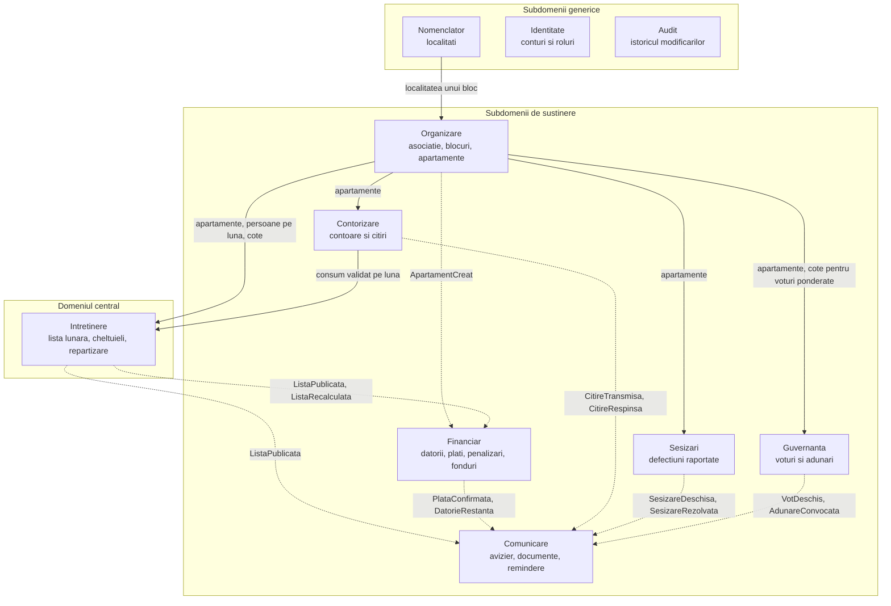
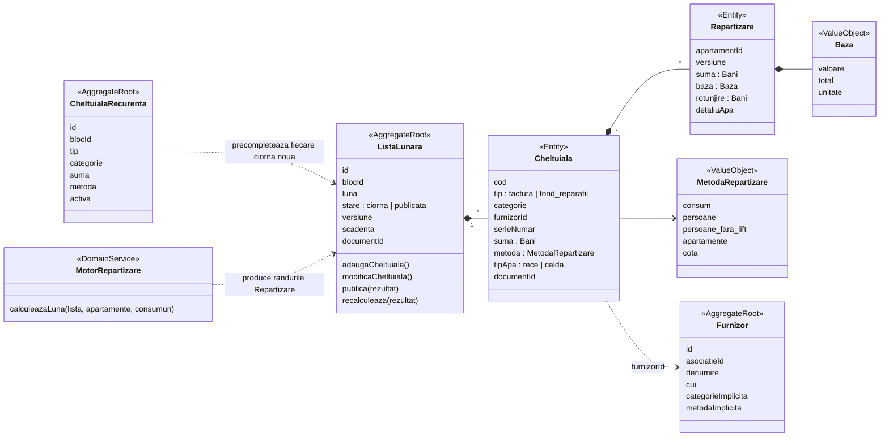
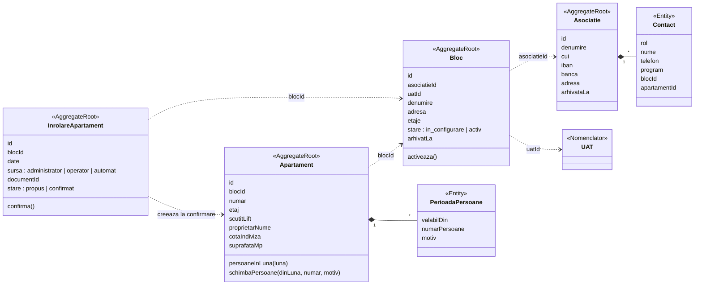
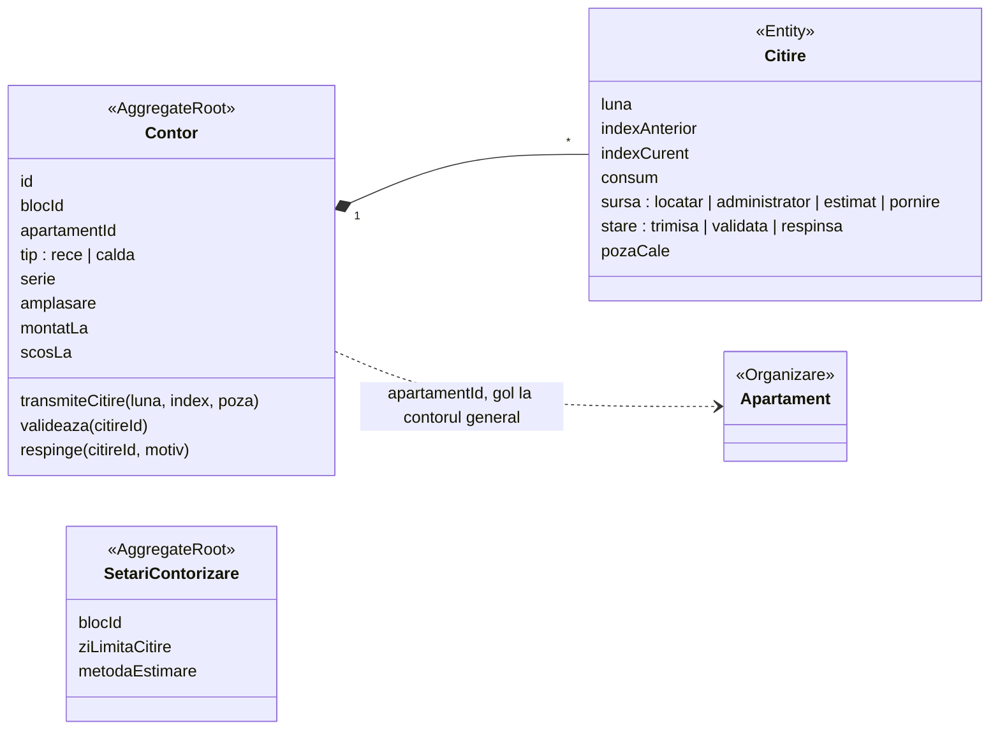
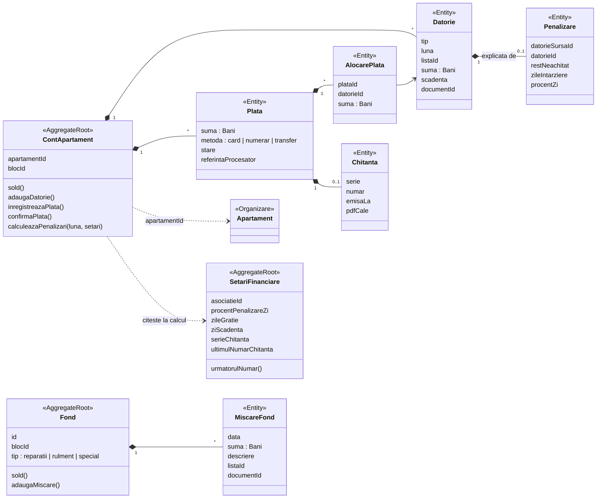
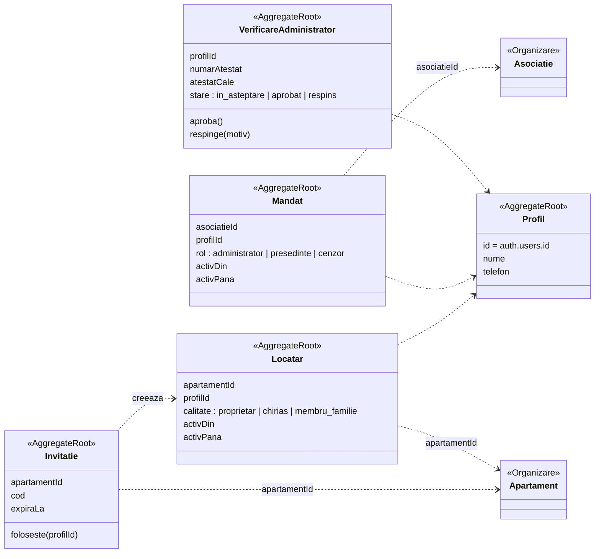
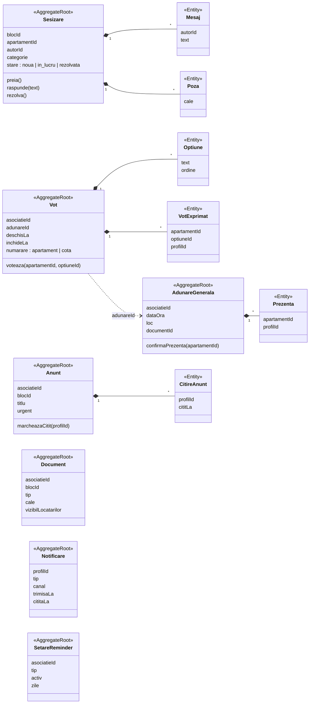

# AdminBloc: propunere de schema pentru baza de date

Sursa: `AdminBloc-functii.pdf` (4 pagini: functionalitati, ce vede si ce face un locatar, ce vede
si ce face un administrator, ce vede si ce face dezvoltatorul), verificata fata de datele mock si
de codul de calcul din `src/AdminBloc.jsx`, sectiunile 3-4. Stadiu: **propunere, nimic nu este
migrat inca.** Singura tabela existenta este `administratii_locale`. Domeniul este modelat
dupa Domain-Driven Design (§2): bounded contexts, agregate si evenimente de domeniu.

Conventiile urmeaza `supabase/migrations/20260907115303_administratii_locale.sql` si skill-ul
`adaugare-migratie`: identificatori in romana fara diacritice, `id uuid default
gen_random_uuid()`, `creat_la` / `actualizat_la` + trigger-ul existent `seteaza_actualizat_la()`,
constrangeri `check` cu nume, `on delete restrict`, un index pe fiecare cheie straina si RLS
explicit pe fiecare tabela.

---

## 1. Ideile pe care se sprijina schema

Aceste sapte decizii dau forma tuturor tabelelor de mai jos. Conteaza mai mult decat orice
coloana luata separat.

### 1.1 Sumele calculate se salveaza, nu se recalculeaza din mers

Promisiunea aplicatiei este "Orice suma se deschide si isi arata calculul, factura si documentul
justificativ". Daca randul unui locatar s-ar recalcula la fiecare deschidere a paginii, atunci o
schimbare in septembrie a numarului de persoane dintr-un apartament ar modifica pe tacute sumele
din lista din iulie, care a fost deja platita. De aceea motorul de calcul ruleaza **o singura
data**, cand administratorul publica lista, iar rezultatul se scrie in `repartizari` impreuna cu
baza folosita (de exemplu `3 persoane din 49` sau `12,7 m³ + 0,84 m³ din diferenta × 7,67 lei/m³`).
Ecranul citeste acel rand. Ce a vazut locatarul in ziua in care a platit este exact ce va vedea
si peste un an.

Aceasta este varianta pentru baza de date a regulii din CLAUDE.md, "motorul este singura sursa
de adevar": motorul ramane singurul lucru care produce cifre, iar baza de date doar pastreaza ce
a produs el.

### 1.2 Motorul ramane in JavaScript

Sectiunile 2-4 din `AdminBloc.jsx` sunt intentionat JS pur. Propunerea le pastreaza asa:

- **Previzualizarea** ("Vede pe loc cum cade suma pe apartamente, inainte sa salveze") ruleaza
  motorul in browser. Nu se scrie nimic.
- **Publicarea** apeleaza o Edge Function `publica-lista` care ruleaza **acelasi fisier** (Deno il
  importa neschimbat) si trimite rezultatul unei singure functii Postgres,
  `intretinere.salveaza_lista_publicata()`. Intr-o singura tranzactie, functia scrie
  `repartizari`, marcheaza lista ca publicata si inregistreaza evenimentul `ListaPublicata`,
  astfel ca o eroare nu lasa nimic scris pe jumatate. (supabase-js nu poate tine o tranzactie
  deschisa peste mai multe apeluri, de aceea scrierea se face intr-o singura functie din baza de
  date.) Financiar reactioneaza la eveniment si creeaza datoriile (§2.3, §2.6).

Rescrierea repartizarii in PL/pgSQL ar crea o a doua implementare, care poate ajunge sa nu fie de
acord cu prima. Exact acesta este bug-ul "lista locatarului si raportul administratorului se
contrazic", pe care aplicatia exista ca sa il previna.

### 1.3 Banii sunt un registru in care doar se adauga, nu o coloana `sold`

Mock-ul are `SOLDURI_INITIALE` si `ZILE_INTARZIERE` ca numere fixe. Intr-o baza de date reala, o
coloana `sold` modificabila este sursa clasica pentru "aplicatia zice ca am de dat 412 lei si nu
stiu de ce". In schimb:

- tot ce se datoreaza este un rand in `datorii` (intretinerea pe o luna, o penalizare, fondul de
  rulment, soldul initial, o corectie);
- tot ce se plateste este un rand in `plati`;
- `alocari_plati` retine ce plata a acoperit ce datorie.

**Sold = Σ datorii − Σ plati**, calculat printr-un view. Fiecare leu poate fi urmarit pana la un
document, iar "cate zile de intarziere" se calculeaza pentru fiecare datorie neachitata, adica
exact ce le trebuie penalizarilor.

### 1.4 Istoric pentru tot ce intra intr-un calcul

Numarul de persoane se schimba; repartizarea pentru mai trebuie sa foloseasca numarul din mai.
De aceea persoanele stau in `apartamente_persoane`, cu o luna `valabil_din`, nu intr-o singura
coloana pe apartament. Citirile de contor pastreaza atat indexul anterior, cat si pe cel curent.
Setarile care influenteaza bani (procentul de penalizare, zilele de gratie) se copiaza in randul
din `penalizari` care le-a folosit, asa ca schimbarea unei setari nu rescrie niciodata istoricul.

### 1.5 Doua niveluri: `asociatii` si `blocuri`

PDF-ul spune "Toate blocurile si toate asociatiile din platforma". O asociatie de proprietari
(entitatea juridica, cu CUI, cont bancar si administrator) poate administra mai multe
blocuri/scari. Mock-ul arata exact asta: `"Bloc D14, scara A"` apartine de
`"Asociatia de proprietari nr. 118"`.

- **Nivelul asociatiei:** chestiuni juridice si de oameni: administratori, setari financiare,
  furnizori, numerotarea chitantelor, adunari generale, voturi.
- **Nivelul blocului:** tot ce se calculeaza: apartamente, contoare, liste lunare, fonduri,
  sesizari.

Sectiunea 2 merge mai departe si imparte domeniul in bounded contexts. Aceasta impartire pe doua
niveluri este cea comuna tuturor contextelor.

Tabela `asociatii` este entitatea "administratia blocului" despre care nota din memorie despre
`administratie-locala` spune ca inca nu are tabela. Ramane separata de
`administratii_locale` (UAT-ul in care se afla un bloc).

### 1.6 `bloc_id` se repeta intentionat pe tabelele copil

`repartizari`, `datorii`, `plati`, `citiri` si `sesizari` au `bloc_id`, desi el poate fi aflat si
prin `apartament_id`. Doua motive:

1. **RLS ramane o singura comparatie indexata**, `bloc_id in (select private.blocuri_administrate())`,
   in loc de un join pe fiecare rand.
2. **Exportul tuturor datelor unui bloc** devine `where bloc_id = $1` pe fiecare tabela.

Ca sa nu ajunga niciodata copia in dezacord cu apartamentul, aceste tabele folosesc o **cheie
straina compusa** `(apartament_id, bloc_id) → organizare.apartamente (id, bloc_id)`. Baza de date
refuza un rand al carui apartament apartine altui bloc. In Financiar, cheia compusa sta doar pe
`conturi`; `datorii` si `plati` trimit la propriul cont, conform regulilor pentru agregate din
§2.3.

### 1.7 Scrierea banilor este treaba serverului

Locatarii si administratorii nu fac niciodata `insert` direct in `repartizari`, `datorii`,
`penalizari`, `chitante` sau intr-un rand `plati` confirmat. Acestea sunt scrise de handlere de
eveniment, de Edge Functions (service role) sau de functii `security definer` care valideaza
inainte. RLS pe aceste tabele este **doar de citire** pentru toata lumea. Rolul de dezvoltator din
PDF nu are ecrane: foloseste service role (dashboard-ul Supabase / CLI), care ocoleste RLS, deci
nu are nevoie de tabela.

---

## 2. Modelul domeniului (DDD)

Diagrama la nivel de tabele era incalcita pentru ca desena toate cheile straine deodata. Aceasta
sectiune imparte domeniul in **bounded contexts (contexte delimitate)**: fiecare are propriul
limbaj, propriile **agregate** (un grup de randuri care trebuie sa ramana consistente impreuna,
modificate printr-o singura radacina) si propria schema Postgres. Contextele se refera unul la
altul doar prin ID-ul radacinii unui agregat.

### 2.1 Subdomenii si contexte

| Context | Schema Postgres | Fel | La ce raspunde |
|---|---|---|---|
| **Intretinere** | `intretinere` | **central** | Cat plateste fiecare apartament luna aceasta si de ce? |
| Organizare | `organizare` | de sustinere | Ce asociatie, blocuri, apartamente, proprietari, persoane, cote? |
| Contorizare | `contorizare` | de sustinere | Cata apa au consumat fiecare apartament si blocul intreg? |
| Financiar | `financiar` | de sustinere | Cat datoreaza fiecare apartament, cat a platit, ce penalizari are, ce e in fonduri? |
| Sesizari | `sesizari` | de sustinere | Ce s-a stricat si cine repara? |
| Guvernanta | `guvernanta` | de sustinere | Ce au hotarat proprietarii si cine a participat? |
| Comunicare | `comunicare` | de sustinere | Anunturi, documente, remindere, notificari |
| Identitate | `identitate` (+ Supabase Auth) | generic | Cine este autentificat si ce rol are si unde? |
| Nomenclator | `nomenclator` | generic | Localitatile din Romania (tabela existenta `administratii_locale`) |
| Audit | `audit` (neexpus) | generic | Cine a schimbat ce si cand? |

**Intretinere este domeniul central.** Este motivul pentru care exista aplicatia (formula din
spatele fiecarei sume) si singurul loc in care banii sunt *calculati*. Toate celelalte fie il
alimenteaza (Organizare, Contorizare), fie reactioneaza la el (Financiar, Comunicare).

### 2.2 Harta contextelor

Sageti continue: contextul din aval **citeste** contextul din amonte cand are nevoie de date
(prin view-urile publice ale acestuia). Sageti punctate: contextul din aval **reactioneaza la un
eveniment** publicat de contextul din amonte.

Identitate si Audit sunt lasate intentionat in afara sagetilor: **toate** contextele le folosesc.
Fiecare politica RLS intreaba Identitate "cine este si ce are voie sa vada", iar fiecare tabela
importanta scrie in Audit. Tocmai desenarea acestor legaturi facea vechea diagrama imposibil de
citit.

### 2.3 Reguli intre contexte

1. **Se refera doar radacinile agregatelor, doar prin ID.** Cheia straina se pastreaza (aceeasi
   baza de date, integritatea vine gratis) si este mereu `on delete restrict`. Nimic din afara
   Financiar nu trimite la `alocari_plati` si nimic din afara Intretinere nu trimite la un rand
   anume din `cheltuieli`.
2. **Alt context se citeste doar prin interfata lui publica.** Fiecare schema expune cateva
   view-uri sau functii pentru celelalte contexte, de ex. `organizare.persoane_pe_luna(bloc_id, luna)`
   sau `contorizare.consum_validat(bloc_id, luna)`. Motorul le apeleaza pe acestea, niciodata
   tabelele direct, asa ca un context isi poate reorganiza tabelele fara sa-si strice vecinii.
3. **O tranzactie modifica un singur agregat.** Cand o modificare trebuie sa produca o modificare
   in alta parte, agregatul inregistreaza un **eveniment de domeniu** in aceeasi tranzactie (§2.6),
   iar celalalt context reactioneaza la el. Exemplu: publicarea unei liste nu scrie ea insasi
   datoriile. Inregistreaza `ListaPublicata`, iar Financiar creeaza datoriile.
4. **Identitate este shared kernel (nucleu comun).** Functiile ajutatoare pentru RLS din `private`
   sunt singurul cod comun tuturor contextelor.
5. **Acelasi cuvant inseamna un singur lucru in interiorul unui context.** Vezi glosarul (§2.7).
### 2.4 Agregatele fiecarui context

Notatie: `<<AggregateRoot>>` este punctul de intrare intr-un agregat. `<<Entity>>` traieste in
interiorul agregatului si se modifica doar prin radacina. `<<ValueObject>>` nu are identitate.
Clasele marcate cu numele altui context (de exemplu `<<Organizare>>`) apartin acelui context si
apar doar ca sa se vada referinta prin ID. Numele sunt in camelCase, ca in motorul JS.
Coloanele corespunzatoare sunt in snake_case (`cotaIndiviza` → `cota_indiviza`).

#### Intretinere (domeniu central)

- **Invariantii lui `ListaLunara`:** cheltuielile se modifica doar cat timp `stare = 'ciorna'`.
  La publicare, randurile `Repartizare` ale fiecarei cheltuieli insumeaza exact `suma`
  cheltuielii (regula de rotunjire). O cheltuiala `consum` are intotdeauna `tipApa`.
- **`MotorRepartizare`** este motorul existent, in JS pur (§1.2). E un serviciu de domeniu
  pentru ca are nevoie de date din trei locuri (lista, apartamentele din Organizare, consumul
  din Contorizare) si nu apartine niciunuia dintre ele.
- **`CheltuialaRecurenta`** este noua. Tine contributia lunara la fondul de reparatii (fostul
  `FOND_REPARATII_LUNAR`) si orice alt rand fix lunar, asa ca fiecare lista noua in ciorna
  porneste precompletata. Inlocuieste coloanele de fonduri care stateau pe `blocuri` si nu
  tineau de Organizare.

#### Organizare

- **`Apartament` este un agregat separat, nu face parte din `Bloc`.** Schimbarea numarului de
  persoane din apartamentul 17 nu trebuie sa blocheze tot blocul, iar cele doua se schimba din
  motive diferite.
- **Invariantul lui `Apartament`:** istoricul persoanelor are cel mult un rand pe luna si nu se
  editeaza niciodata, doar se completeaza.
- **Intre agregate:** cotele indivize ale unui bloc insumeaza 100. Regula acopera 20 de
  agregate, asa ca e verificata de view-ul `organizare.verificari_bloc` si aratata
  administratorului, nu impusa printr-o constrangere.

#### Contorizare

- **Invariantii lui `Contor`:** cel mult o citire valabila pe luna, iar indexul nu scade
  niciodata.
- **`SetariContorizare`** este noua. Tine termenul-limita pentru citiri (inainte pe `asociatii`)
  si regula de estimare ("media ultimelor trei luni"), care azi exista doar ca text in mockup.

#### Financiar

- **`ContApartament` este nou** (tabela `conturi`, un rand pe apartament). Este granita de
  consistenta pentru bani: un webhook de card si o plata cash pentru acelasi apartament, sosite
  in acelasi moment, iau amandoua mai intai lock pe acest rand (`select ... for update`), asa ca
  aceeasi datorie nu poate fi acoperita de doua ori.
- **Invariantii lui `ContApartament`:** alocarile nu depasesc niciodata plata sau datoria
  ramasa. O penalizare nu depaseste niciodata datoria la care se aplica. In `sold()` conteaza
  doar platile confirmate.
- **`SetariFinanciare` este nou.** Preia de pe `asociatii` procentul de penalizare, zilele de
  gratie, ziua scadentei si numerotarea chitantelor. Sunt reguli financiare, iar contorul de
  chitante are nevoie de un rand propriu pe care sa se ia lock.
- **`MiscareFond` trimite la lista (`listaId`), nu la o cheltuiala anume.** O cheltuiala se afla
  in interiorul agregatului `ListaLunara` si nu poate fi referita din afara lui.

#### Identitate

Tabelele isi pastreaza numele de dinainte: `profiluri`, `administratori`, `membri_asociatie`,
`locatari`, `invitatii`.

#### Sesizari, Guvernanta, Comunicare

- **Invariantul lui `Vot`:** un singur vot pentru fiecare apartament la un vot dat, si doar cu
  optiunile acelui vot.
- **`Document` apartine contextului Comunicare**, pentru ca rostul lui este sa fie afisat. Alte
  contexte (o factura scanata, chitantele fondurilor, procesul-verbal al unei adunari) il
  refera prin `documentId`.

### 2.5 De la model la Supabase

| Concept DDD | Implementare in Supabase |
|---|---|
| Bounded context | o schema Postgres, adaugata in `[api] schemas` din `supabase/config.toml` ca s-o serveasca Data API; `grant usage` catre `anon` / `authenticated` doar unde e nevoie |
| Radacina agregatului | o tabela; aplicatia modifica un agregat printr-o **singura functie RPC** pe comanda (`intretinere.publica_lista`, `financiar.inregistreaza_plata_numerar`) sau printr-un insert/update simplu cand RLS il poate proteja singur (un locatar care depune o sesizare) |
| Entitate din interiorul unui agregat | o tabela spre care cheile straine din afara contextului sunt interzise (§2.3) |
| Value object | o coloana sau un grup de coloane cu constrangeri `check` (`Bani` = `numeric(12,2)`, `Luna` = `date` cu prima zi a lunii) |
| Serviciu de domeniu | motorul JS dintr-o Edge Function; joburile de penalizari si de remindere in `pg_cron` |
| Interfata publica a unui context | view-uri cu `security_invoker = true` si functii SQL `stable` |
| Eveniment de domeniu | un rand in `evenimente.coada`, scris in aceeasi tranzactie cu modificarea |
| Handler de eveniment | un Database Webhook pe insert in `evenimente.coada` apeleaza Edge Function-ul `proceseaza-eveniment`, care ruleaza functia contextului consumator |
| Shared kernel (nucleu comun) | schema `private`: functiile ajutatoare pentru RLS din Identitate |
| Strat anticoruptie | Edge Function-urile care vorbesc cu lumea din afara (in propunere: procesatorul de carduri, scos intre timp), ca vocabularul ei sa nu intre niciodata in `financiar` |

`evenimente.coada` (nu e expusa prin API):

| Coloana | Tip | Note |
|---|---|---|
| `id` | bigint generated always as identity pk | ordinea de procesare |
| `tip` | text not null | `ListaPublicata`, `PlataConfirmata`, … |
| `context` | text not null | contextul care l-a publicat |
| `agregat_id` | uuid not null | |
| `date` | jsonb not null | ce le trebuie consumatorilor, de ex. `{ lista_id, versiune, bloc_id }` |
| `creat_la` | timestamptz not null default now() | |
| `procesat_la` | timestamptz | null pana cand toate handlerele au reusit |
| `incercari`, `ultima_eroare` | | reincercari |

Pentru ca evenimentul se scrie in aceeasi tranzactie cu modificarea, nu se poate pierde. Un
job `pg_cron` retrimite, dupa cateva minute, tot ce a ramas neprocesat. De aceea fiecare
handler trebuie sa poata rula de doua ori fara efecte nedorite. De exemplu, datoriile au cheia
unica `(lista_id, versiune, apartament_id, tip)`, asa ca un `ListaPublicata` repetat nu mai
creeaza nimic nou.

### 2.6 Evenimente de domeniu

| Eveniment | Publicat de | Consumat de | Efect |
|---|---|---|---|
| `ListaPublicata` | Intretinere | Financiar | cate o datorie de intretinere pe apartament; o miscare in fondul de reparatii |
| | | Comunicare | reminderul "a iesit lista" (daca e activat) |
| `ListaRecalculata` | Intretinere | Financiar | o datorie `corectie` cu diferenta (§7) |
| | | Comunicare | notificarea "lista ta a fost corectata" |
| `CitireTransmisa` | Contorizare | Comunicare | ii spune administratorului ca are o citire de verificat |
| `CitireRespinsa` | Contorizare | Comunicare | ii spune locatarului de ce si ii cere o poza noua |
| `PlataConfirmata` | Financiar | Comunicare | trimite chitanta |
| `DatorieRestanta` | Financiar | Comunicare | instiintare de plata pentru restanta (reminderul R4) |
| `SesizareDeschisa` / `SesizareRezolvata` | Sesizari | Comunicare | anunta administratorul / autorul |
| `VotDeschis` / `AdunareConvocata` | Guvernanta | Comunicare | anunta proprietarii |
| `AdministratorAprobat` | Identitate | Comunicare | mesaj de bun venit |
| `ApartamentCreat` | Organizare | Financiar | deschide contul apartamentului (`conturi`) |

Pentru citiri **nu** e nevoie de un eveniment `CitireValidata` catre Intretinere: motorul ii
cere contextului Contorizare consumul validat chiar in momentul calculului.

### 2.7 Glosar

| Termen | Context | Inteles |
|---|---|---|
| asociatie | Organizare | asociatia de proprietari, persoana juridica ce administreaza unul sau mai multe blocuri |
| bloc | Organizare | o cladire sau o scara; unitatea pentru care se calculeaza o lista lunara |
| cota indiviza | Organizare | procentul unui apartament din proprietatea comuna |
| lista lunara | Intretinere | lista de intretinere a lunii pentru un bloc; `ciorna` sau `publicata` |
| cheltuiala | Intretinere | un rand de impartit: o factura de la furnizor sau o contributie la un fond |
| repartizare | Intretinere | partea unui apartament dintr-un rand, impreuna cu baza din care s-a calculat |
| baza | Intretinere | cifrele din spatele unei parti: `3` din `49` de persoane |
| contor / citire | Contorizare | un contor de apa / o citire lunara a lui |
| contor general | Contorizare | contorul principal al blocului; diferenta fata de contoarele din apartamente se imparte pe persoane |
| datorie | Financiar | o suma pe care o datoreaza un apartament, cu o scadenta |
| plata / alocare | Financiar | banii primiti / ce datorie au acoperit acei bani |
| penalizare | Financiar | o datorie adaugata pentru plata cu intarziere, cu formula ei pastrata |
| sold | Financiar | datoriile minus platile confirmate; mereu calculat, niciodata stocat |
| fond / miscare | Financiar | un fond (de reparatii, de rulment) / bani care intra in el sau ies din el |
| mandat | Identitate | rolul unei persoane (administrator, presedinte, cenzor) intr-o asociatie |
| locatar | Identitate | o persoana legata de un apartament (proprietar, chirias, membru al familiei) |

---

## 3. Tabele

Coloanele comune nu se mai repeta mai jos: fiecare tabela are `id uuid pk`, `creat_la` si
`actualizat_la`, daca nu se spune altfel. `luna` este intotdeauna un `date` cu check-ul
`extract(day from luna) = 1` (prima zi a lunii). Daca stocam o data in loc de textul
`'2026-07'`, primim gratuit sortare corecta, aritmetica pe date si interogari pe intervale.
Toate sumele sunt `numeric(12,2)` (exacte la ban, niciodata `float`).

Tabelele sunt grupate pe bounded context (§2.1). Titlul fiecarui grup numeste schema Postgres,
iar cheile straine catre alt context sunt scrise cu prefixul schemei.

### A. Organizare: schema `organizare`

#### `asociatii`: asociatia de proprietari (administratia blocului)

| Coloana | Tip | Note |
|---|---|---|
| `denumire` | text not null | "Asociatia de proprietari nr. 118" |
| `cui` | text | codul fiscal; unic cand exista |
| `iban`, `banca` | text | apar pe chitante si pe instiintarile de plata |
| `adresa`, `telefon`, `email` | text | |
| `arhivata_la` | timestamptz | stergere logica, vezi §6 |

**De ce:** asociatia este cea pentru care lucreaza aplicatia: persoana juridica ce incaseaza
banii, semneaza contractele si are un administrator. Setarile care stateau aici s-au mutat in
contextul care detine fiecare regula: penalizarile, ziua scadentei si numerotarea chitantelor
in `financiar.setari_financiare`, termenul pentru citiri in `contorizare.setari_contorizare`.

#### `blocuri`: o cladire / scara, unitatea pentru care se calculeaza o lista lunara

| Coloana | Tip | Note |
|---|---|---|
| `asociatie_id` | uuid → asociatii | |
| `uat_id` | uuid → nomenclator.administratii_locale | localitatea, refolosind tabela existenta |
| `denumire` | text not null | "Bloc D14, scara A" |
| `adresa` | text not null | |
| `etaje` | smallint not null | check `>= 0` |
| `stare` | text not null default 'in_configurare' | `in_configurare` · `activ` (§11.4) |
| `activat_la` | timestamptz | |
| `arhivat_la` | timestamptz | |

**De ce:** motorul imparte costurile la "toate apartamentele din bloc". Daca unitatea asta e
explicita, `TOTAL_PERSOANE` si `TOTAL_APARTAMENTE` devin interogari simple. Sumele pentru
fonduri care erau aici s-au mutat in `intretinere.cheltuieli_recurente` (contributia lunara)
si in `financiar.fonduri` (suma pentru fondul de rulment pe apartament).

#### `apartamente`: fisa apartamentului

| Coloana | Tip | Note |
|---|---|---|
| `bloc_id` | uuid → blocuri | |
| `numar` | text not null | text, pentru ca exista "3A" si "12bis"; unic `(bloc_id, numar)` |
| `etaj` | smallint not null | 0 = parter |
| `scutit_lift` | boolean not null default false | aplicatia il pune pe true pentru parter |
| `proprietar_nume` | text not null | apare si cand proprietarul nu are cont |
| `cota_indiviza` | numeric(7,4) not null | procent din proprietatea comuna; check `> 0 and <= 100` |
| `suprafata_mp` | numeric(7,2) | |

In plus, `unique (id, bloc_id)`, tinta cheilor straine compuse din §1.6.

**De ce `scutit_lift` in loc sa-l deducem din `etaj = 0`:** mock-ul are fixat in cod "parterul
nu plateste lift", dar asociatiile mai scutesc si etajul 1 sau un apartament cu intrare
separata. Metoda `persoaneFaraParter` inseamna atunci "persoanele din apartamentele nescutite
de lift", cu acelasi rezultat pe datele din mock si cu rezultate corecte in celelalte cazuri.
**De ce numele proprietarului ca text:** fisa apartamentului din PDF arata un "proprietar"
pentru fiecare apartament, iar cei mai multi nu vor avea cont inca multa vreme.

Suma `cota_indiviza` pe bloc ar trebui sa fie 100. Un `check` nu poate impune asta pe mai
multe randuri, asa ca abaterea e raportata de view-ul `verificari_bloc` (§5) si afisata
administratorului.

#### `apartamente_persoane`: cate persoane locuiesc acolo, in timp

| Coloana | Tip | Note |
|---|---|---|
| `apartament_id` | uuid → apartamente | |
| `valabil_din` | date not null | o data cu prima zi a lunii; unic `(apartament_id, valabil_din)` |
| `numar_persoane` | smallint not null | check `>= 0` |
| `motiv` | text | "declaratie noua", "deces", ... |
| `modificat_de` | uuid → identitate.profiluri | |

Nu e nevoie de `id`/`actualizat_la` peste cele implicite, dar randurile **nu se actualizeaza
niciodata**, doar se adauga.

**De ce:** "Modifica numarul de persoane dintr-un apartament" este o actiune a
administratorului in PDF, iar numarul de persoane intra in trei metode de repartizare plus in
diferenta la apa. Numarul pentru luna L este randul cu cel mai recent `valabil_din <= L`.
Astfel, recalcularea unei luni vechi (o actiune a dezvoltatorului in PDF) da acelasi rezultat
ca prima data.

#### `inrolare_apartamente`: apartamentele propuse, inainte de confirmare

| Coloana | Tip | Note |
|---|---|---|
| `bloc_id` | uuid → blocuri | |
| `numar` | text not null | unic `(bloc_id, numar)` cat timp randul e `propus` |
| `date` | jsonb not null | valorile propuse: etaj, proprietar, persoane, cota, suprafata, restanta, indexuri de pornire |
| `sursa` | text not null | `administrator` · `operator` · `automat` |
| `document_id` | uuid → comunicare.documente, null | poza foii de pe care s-a preluat randul |
| `stare` | text not null default 'propus' | `propus` · `confirmat` |
| `confirmat_de`, `confirmat_la` | | administratorul care a comparat randul cu hartia |
| `apartament_id` | uuid → apartamente, null | apartamentul creat la confirmare |

**De ce:** evidenta asociatiilor este pe hartie (§11.4). Datele pot veni de la administrator, de
la un operator care le tasteaza dupa poze sau de la o citire automata a pozei. Oricare ar fi
sursa, nimic nu ajunge in `apartamente` pana cand administratorul nu confirma randul cu foaia in
fata. `date` este `jsonb` pentru ca randul este o propunere, nu inca un apartament: se valideaza
complet abia la confirmare, cand devine randuri in `apartamente`, `apartamente_persoane`,
`contorizare.citiri` si `financiar.datorii`.

#### `contacte`: "Pe cine suna"

| Coloana | Tip | Note |
|---|---|---|
| `asociatie_id` | uuid → asociatii | |
| `bloc_id` | uuid → blocuri, null | null = toata asociatia |
| `rol` | text not null | `administrator` · `presedinte` · `cenzor` · `lift` · `altul` |
| `nume`, `telefon` | text not null | |
| `program` | text | "Marti si joi, 17:00 - 19:00" |
| `apartament_id` | uuid → apartamente, null | "Ioana Stancu, ap. 12" |
| `ordine` | smallint | ordinea de afisare |

**De ce separat de `membri_asociatie`:** PDF-ul trece "omul cu liftul" printre contacte, iar
el nu va avea niciodata cont. Contactele sunt ce vede locatarul; calitatea de membru este ce
da acces. Daca le-am amesteca, am fi obligati sa facem conturi false pentru oameni care au
doar un numar de telefon.

### B. Identitate: schema `identitate`

#### `profiluri`: un rand pentru fiecare cont de autentificare

| Coloana | Tip | Note |
|---|---|---|
| `id` | uuid pk → auth.users on delete cascade | fara valoare implicita proprie |
| `nume` | text not null | |
| `telefon` | text | |

**De ce:** de email, parola si telefon se ocupa Supabase Auth. Tot ce e in `public` trimite la
`profiluri`, niciodata direct la `auth.users`, asa ca API-ul nu trebuie sa expuna niciodata
schema `auth`. Randul e creat de un trigger la insert in `auth.users`.

#### `administratori`: verificarea administratorilor

| Coloana | Tip | Note |
|---|---|---|
| `profil_id` | uuid pk → profiluri | |
| `numar_atestat` | text | numarul atestatului profesional al administratorului |
| `atestat_cale` | text | calea atestatului scanat in Storage |
| `stare` | text not null default 'in_asteptare' | `in_asteptare` · `aprobat` · `respins` |
| `motiv_respingere` | text | |
| `verificat_la` | timestamptz | |

**De ce:** PDF-ul are "Toti administratorii si daca au fost verificati" si "Aprob sau resping
un administrator care se inregistreaza". Doar service role poate schimba `stare`. Functiile
ajutatoare pentru RLS trateaza un administrator ca activ **doar daca** `stare = 'aprobat'`,
asa ca un cont neverificat nu vede nimic din nicio asociatie, chiar daca e legat de una.

#### `membri_asociatie`: cine conduce o asociatie si in ce rol

| Coloana | Tip | Note |
|---|---|---|
| `asociatie_id` | uuid → organizare.asociatii | |
| `profil_id` | uuid → profiluri | |
| `rol` | text not null | `administrator` · `presedinte` · `cenzor` |
| `activ_din` / `activ_pana` | date | mandatele se termina; istoricul se pastreaza |

Unic `(asociatie_id, profil_id, rol)`.

**De ce:** permisiuni, spre deosebire de datele de contact. Presedintele si cenzorul sunt roluri
reale, cu atributii de control: propunerea le da acces de **citire** la ecranele
administratorului si acces de scriere la nimic. Vezi intrebarea deschisa din §8.

#### `locatari`: ce persoana tine de ce apartament

| Coloana | Tip | Note |
|---|---|---|
| `apartament_id` | uuid → organizare.apartamente | |
| `bloc_id` | uuid | cheie straina compusa cu `apartament_id` → `organizare.apartamente` |
| `profil_id` | uuid → profiluri | |
| `calitate` | text not null | `proprietar` · `chirias` · `membru_familie` |
| `activ_din` | date not null default current_date | |
| `activ_pana` | date, null | inchiderea accesului la vanzare sau mutare (§11.6) |

Unic partial `(apartament_id, profil_id) where activ_pana is null`: o persoana are cel mult o
legatura activa cu un apartament, iar legaturile vechi raman ca istoric.

**De ce o tabela de legatura:** o familie imparte acelasi apartament (mai multe conturi), iar o
persoana poate detine doua apartamente. Ambele cazuri sunt frecvente.

#### `invitatii`: cum intra un locatar in apartamentul lui

| Coloana | Tip | Note |
|---|---|---|
| `apartament_id` | uuid → organizare.apartamente | |
| `cod` | text not null unique | 6-8 caractere, fara caractere usor de confundat (0/O, 1/I) |
| `calitate` | text not null | aleasa de administrator: `proprietar` · `chirias` · `membru_familie` |
| `creat_de` | uuid → profiluri | |
| `expira_la` | timestamptz not null | |
| `folosita_de`, `folosita_la` | | |
| `revocata_la` | timestamptz | administratorul poate anula un cod nefolosit |

**De ce:** utilizatorii au peste 50 de ani si nu sunt tehnici. "Administratorul iti da un cod
scurt, il scrii si ai intrat" este cel mai simplu mod de a lega un cont de un apartament
fara ca oricine sa poata revendica apartamentul altcuiva. Codul se foloseste printr-o functie
`security definer`, niciodata printr-un insert direct in `locatari`.

### C. Intretinere (domeniul central): schema `intretinere`

#### `furnizori`: furnizorii

| Coloana | Tip | Note |
|---|---|---|
| `asociatie_id` | uuid → organizare.asociatii | |
| `denumire` | text not null | "Apa Canal 2000 Arges" |
| `cui` | text | |
| `categorie_implicita` | text | precompleteaza formularul de cheltuiala |
| `metoda_implicita` | text | aceleasi valori ca `cheltuieli.metoda` |

**De ce:** aceiasi opt furnizori revin in fiecare luna. Daca precompletam categoria si metoda,
"Adauga o factura" devine "alegi furnizorul, scrii suma", ceea ce li se potriveste
utilizatorilor.

#### `cheltuieli_recurente`: randurile care revin in fiecare luna

| Coloana | Tip | Note |
|---|---|---|
| `bloc_id` | uuid → organizare.blocuri | |
| `tip` | text not null | `fond_reparatii` · `factura` |
| `categorie` | text not null | "Fond de reparatii" |
| `suma` | numeric(12,2) not null | check `> 0` |
| `metoda` | text not null | aceleasi valori ca `cheltuieli.metoda` |
| `hotarare` | text | "Hotarare AG din 12.03.2026" |
| `activa` | boolean not null default true | |

**De ce:** contributia la fondul de reparatii este o suma lunara votata o singura data de
adunarea generala (`FOND_REPARATII_LUNAR` din mock), iar PDF-ul trece "valoarea fondului de
reparatii" printre parametrii pe care dezvoltatorul trebuie sa-i poata schimba. Fiecare lista
noua in ciorna e precompletata din randurile active, iar administratorul poate ajusta in
continuare ciorna. Schimbarea sumei aici nu modifica niciodata o lista publicata, pentru ca
lista are propria copie in `cheltuieli`.

#### `liste_lunare`: lista lunara de intretinere a unui bloc

| Coloana | Tip | Note |
|---|---|---|
| `bloc_id` | uuid → organizare.blocuri | |
| `luna` | date not null | unic `(bloc_id, luna)` |
| `stare` | text not null default 'ciorna' | `ciorna` · `publicata` |
| `versiune` | smallint not null default 1 | incrementata la o recalculare |
| `scadenta` | date | scadenta pentru locatari |
| `publicata_la`, `publicata_de` | | |
| `document_id` | uuid → comunicare.documente, null | PDF-ul exportat pentru avizier |

**De ce:** inlocuieste `LUNI_DISPONIBILE` / `LISTE` din mock. `ciorna` este etapa in care
administratorul adauga facturi si vede previzualizarea; `publicata` este etapa in care
locatarii o vad si datoriile exista. Dupa publicare, administratorul nu mai poate modifica
cheltuielile listei (RLS). Doar o recalculare (o actiune a dezvoltatorului in PDF) o mai poate
schimba, si creeaza o `versiune` noua in loc sa suprascrie. Vezi §7.

#### `cheltuieli`: un rand de impartit intr-o luna (o factura sau o contributie la un fond)

| Coloana | Tip | Note |
|---|---|---|
| `lista_id` | uuid → liste_lunare | da blocul si luna |
| `tip` | text not null | `factura` · `fond_reparatii` |
| `cod` | text not null | "C1".."C9", codul randului pe care il vede locatarul |
| `categorie` | text not null | "Apa rece si canalizare" |
| `furnizor_id` | uuid → furnizori, null | check: obligatoriu cand `tip = 'factura'` |
| `serie_numar` | text | "ACA-448120", sau "Hotarare AG din 12.03.2026" pentru fond |
| `suma` | numeric(12,2) not null | check `> 0` |
| `metoda` | text not null | `consum` · `persoane` · `persoane_fara_lift` · `apartamente` · `cota` |
| `tip_apa` | text, null | `rece` · `calda`; check: not null **exact atunci cand** `metoda = 'consum'` |
| `data_emitere`, `scadenta_furnizor` | date | |
| `achitata_furnizor_la` | date, null | "care dintre ele sunt platite furnizorului" |
| `document_id` | uuid → comunicare.documente, null | factura scanata sau hotararea AG |

**De ce o tabela numita `cheltuieli` si nu `facturi`:** mock-ul trateaza deja fondul de
reparatii ca pe o "factura fictiva" (`esteFond: true`), pentru ca pentru locatar e doar inca un
rand, impartit pe `cota`. Daca facem asta explicit prin `tip`, pastram un singur drum prin cod
pentru toate randurile, iar check-urile impiedica un rand de fond sa pretinda ca are furnizor.
**De ce `tip_apa`:** azi motorul ghiceste apa rece sau calda cu
`categorie.includes("calda")`. O singura greseala de scriere in numele categoriei ar
repartiza, fara niciun semnal, apa calda dupa contoarele de apa rece. O coloana explicita cu
check elimina riscul asta.
**Numele metodei:** `persoaneFaraParter` devine `persoane_fara_lift`, ca sa se potriveasca cu
`scutit_lift` (§A); eticheta pe care o vede locatarul poate ramane "Pe persoane, fara parter".

#### `repartizari`: rezultatul motorului: cat plateste fiecare apartament pentru fiecare rand

| Coloana | Tip | Note |
|---|---|---|
| `cheltuiala_id` | uuid → cheltuieli | |
| `lista_id` | uuid → liste_lunare | copie, pentru "toata lista intr-o singura interogare" |
| `versiune` | smallint not null | versiunea listei careia ii apartine randul |
| `apartament_id`, `bloc_id` | uuid | cheie straina compusa |
| `suma` | numeric(12,2) not null | check `>= 0` |
| `baza_valoare` | numeric(12,4) | 3 (persoane), 1 (apartament), 4.18 (%), 12.7 (m³) |
| `baza_total` | numeric(12,4) | 49, 20, 100, 428 |
| `unitate` | text | `persoane` · `apartamente` · `%` · `mc` |
| `rotunjire` | numeric(12,2) not null default 0 | cat a adaugat `corecteazaRotunjirea` |
| `detaliu` | jsonb | doar pentru apa: consumul propriu, contorul general, suma contoarelor, diferenta, partea din diferenta, pretul pe m³ |

Unic `(cheltuiala_id, apartament_id, versiune)`.

**De ce:** acesta este `RandLista` stocat in baza de date, elementul semnatura al produsului
(§1.1). Fiecare valoare afisata de randul extins este o coloana aici. `detaliu` este `jsonb`
doar pentru defalcarea la apa, care are o forma specifica si doar se afiseaza, nu se
filtreaza niciodata dupa ea. Restul de la rotunjire e o coloana adevarata pentru ca "de ce
platesc cu 2 bani mai mult decat ceilalti?" este exact intrebarea la care aplicatia trebuie sa
raspunda. Se pastreaza si randurile cu suma zero ("de ce platesc 0 la lift?").

### D. Contorizare: schema `contorizare`

#### `setari_contorizare`: regulile de citire pentru un bloc

| Coloana | Tip | Note |
|---|---|---|
| `bloc_id` | uuid pk → organizare.blocuri | un rand pe bloc, fara `id` propriu |
| `zi_limita_citire` | smallint not null | check `between 1 and 28` |
| `metoda_estimare` | text not null default 'medie_3_luni' | ce se intampla cand nu transmite nimeni citirea |

**De ce:** anuntul din mock spune "Cine nu transmite index primeste consum estimat pe media
ultimelor trei luni". Asta e o regula, iar azi exista doar ca text. Aici devine date pe care le
citeste jobul de estimare.

#### `contoare`: contoarele de apa

| Coloana | Tip | Note |
|---|---|---|
| `bloc_id` | uuid → organizare.blocuri | |
| `apartament_id` | uuid, null | **null = contorul general al blocului** |
| `tip` | text not null | `rece` · `calda` |
| `serie` | text | |
| `amplasare` | text | "baie", "bucatarie" |
| `montat_la`, `scos_la` | date | un contor inlocuit isi pastreaza istoricul |

Index unic partial: un singur contor general activ pe `(bloc_id, tip)` unde `apartament_id is null
and scos_la is null`.

**De ce contorul general sta tot aici:** se citeste la fel si are citiri la fel. `CONTOR_GENERAL`
din mock devine citirile contorului fara apartament. Un apartament cu contor si la bucatarie,
si la baie are pur si simplu doua randuri; motorul le aduna.

#### `citiri`: citirile contoarelor, cu poza

| Coloana | Tip | Note |
|---|---|---|
| `contor_id` | uuid → contoare | |
| `bloc_id`, `apartament_id` | uuid | apartamentul e null pentru contorul general |
| `luna` | date not null | |
| `index_anterior` | numeric(10,3) not null | |
| `index_curent` | numeric(10,3) not null | check `>= index_anterior` |
| `consum` | numeric(10,3) generated always as `(index_curent - index_anterior)` stored | |
| `sursa` | text not null | `locatar` · `administrator` · `estimat` · `pornire` (indexul de la inrolare, §11.5) |
| `stare` | text not null default 'trimisa' | `trimisa` · `validata` · `respinsa` |
| `poza_cale` | text | calea in bucket-ul privat `poze`; poza e micsorata in aplicatie inainte de upload (§10.4) |
| `document_id` | uuid → comunicare.documente, null | pentru `pornire`: foaia de citiri de pe care s-a preluat indexul |
| `transmisa_de` | uuid → identitate.profiluri | |
| `verificata_de`, `verificata_la`, `motiv_respingere` | | |

Index unic partial `(contor_id, luna) where stare <> 'respinsa'`: o citire respinsa poate fi
retrimisa, dar nu exista niciodata mai mult de o citire valabila pe contor pe luna.

**De ce:** acopera "Trimite indexul la apa rece si la apa calda, o data pe luna", "Ataseaza
poza contorului ca dovada", "Confirma sau respinge un index transmis cu poza" si "Indexurile
transmise de locatari, cu pozele lor". `consum` este generat, ca sa nu poata contrazice
niciodata cele doua indexuri. Daca stocam `index_anterior` pe rand (in loc sa-l cautam in luna
trecuta), citirea se explica singura si rezista la inlocuirea contorului. `estimat` inlocuieste
"consum estimat pe media ultimelor trei luni" din mock.

**"Cat consuma fata de media blocului":** o functie `security definer`
`consum_mediu_bloc(bloc_id, luna)` intoarce doar media pe persoana. Un locatar se poate compara
cu ea fara sa citeasca randurile altor apartamente.

### E. Financiar: schema `financiar`

#### `conturi`: contul unui apartament (radacina agregatului pentru bani)

| Coloana | Tip | Note |
|---|---|---|
| `apartament_id` | uuid pk | cheie straina compusa `(apartament_id, bloc_id) → organizare.apartamente (id, bloc_id)` |
| `bloc_id` | uuid not null | unique `(apartament_id, bloc_id)`, tinta pentru `datorii` si `plati` |

**De ce:** §2.4. Orice modificare a banilor unui apartament incepe cu
`select ... from financiar.conturi where apartament_id = $1 for update`. Asa se serializeaza
platile simultane pentru acelasi apartament si nimic altceva. Este singura tabela din Financiar
care trimite in Organizare. Randul e creat de un trigger cand se creeaza apartamentul.

#### `setari_financiare`: regulile de bani ale unei asociatii

| Coloana | Tip | Note |
|---|---|---|
| `asociatie_id` | uuid pk → organizare.asociatii | un rand pe asociatie |
| `procent_penalizare_zi` | numeric(5,3) not null default 0.02 | check `between 0 and 0.2` (0,2 %/zi este plafonul legal pe care il stiu din Legea 196/2018; de verificat inainte de lansare) |
| `zile_gratie` | smallint not null default 30 | penalizarile incep dupa atatea zile de la scadenta |
| `zi_scadenta` | smallint not null | ziua din luna in care lista ajunge la scadenta |
| `chitanta_serie` | text not null | seria chitantelor, de ex. "AP118" |
| `chitanta_ultimul_numar` | integer not null default 0 | vezi `chitante` |

**De ce:** PDF-ul spune ca dezvoltatorul trebuie sa poata schimba "parametrii care azi sunt
fixati in cod: procentul de penalizare, zilele de gratie, valoarea fondului de reparatii".
Primii doi stau aici (al treilea e in `intretinere.cheltuieli_recurente`). `PROCENT_PENALIZARE_ZI`
din mock devine date. Setarile sunt coloane, nu o tabela cheie-valoare, pentru ca sunt putine,
au tipuri diferite, iar check-urile se pot pune doar pe coloane reale.

#### `datorii`: tot ce datoreaza un apartament

| Coloana | Tip | Note |
|---|---|---|
| `apartament_id`, `bloc_id` | uuid | cheie straina compusa → `conturi` |
| `tip` | text not null | `intretinere` · `penalizare` · `fond_rulment` · `sold_initial` · `corectie` |
| `luna` | date, null | luna careia ii apartine |
| `lista_id` | uuid → intretinere.liste_lunare, null | pentru `intretinere` / `corectie` |
| `versiune` | smallint, null | versiunea listei din care provine; unique `(lista_id, versiune, apartament_id, tip)` face ca handlerul de eveniment sa poata rula de doua ori fara efecte |
| `suma` | numeric(12,2) not null | check: `> 0`, cu exceptia `corectie`, care poate fi negativa, dar niciodata 0 |
| `scadenta` | date not null | de aici se numara penalizarile |
| `descriere` | text | |
| `document_id` | uuid → comunicare.documente, null | pentru `sold_initial`: lista de plata pe hartie de pe care s-a preluat restanta |

**De ce:** §1.3. Prin `sold_initial` o asociatie care trece pe aplicatie isi aduce
`SOLDURI_INITIALE`; locatarul vede langa ea poza listei de hartie de unde a fost preluata
(§11.4). Prin `corectie` o luna recalculata schimba suma datorata fara sa
modifice datoria initiala.

#### `plati`: platile primite

| Coloana | Tip | Note |
|---|---|---|
| `apartament_id`, `bloc_id` | uuid | cheie straina compusa → `conturi` |
| `suma` | numeric(12,2) not null | check `> 0` |
| `metoda` | text not null | `numerar` · `transfer` (cardul a fost scos pe 23 septembrie 2026) |
| `stare` | text not null | `confirmata` · `rambursata` |
| `cheie_client` | uuid | unique `(apartament_id, cheie_client)`; cheia cererii care a inregistrat plata [B2] |
| `platita_de` | uuid → identitate.profiluri, null | cine a platit, daca nu este proprietarul |
| `inregistrata_de` | uuid → identitate.profiluri, null | administratorul care a primit numerarul |
| `confirmata_la` | timestamptz | |

**De ce:** *(scris in septembrie 2026, cand plata cu cardul era inca in plan; pe 23 septembrie
2026 a fost scoasa cu totul, vezi mai jos.)* In solduri intra doar platile confirmate.

**Cum este azi:** nu exista plata cu cardul si niciun procesator. Banii ii confirma
administratorul, cu `financiar.inregistreaza_incasare(apartament, suma, metoda, cheie_cerere)`:
`metoda` este `numerar` sau `transfer`, starea este mereu `confirmata`, iar `cheie_client` face
ca a doua apasare pe acelasi buton (dupa un raspuns pierdut pe drum) sa intoarca aceeasi plata,
nu una noua [B2]. Plata + alocare + chitanta raman o singura tranzactie.

#### `alocari_plati`: ce plata a acoperit ce datorie

| Coloana | Tip | Note |
|---|---|---|
| `plata_id` | uuid → plati | |
| `datorie_id` | uuid → datorii | |
| `suma` | numeric(12,2) not null | check `> 0`; unique `(plata_id, datorie_id)` |

**De ce:** un locatar care datoreaza iunie si iulie si plateste 300 lei a platit *ceva*.
Penalizarile se calculeaza pe ce a ramas neachitat din fiecare datorie, deci baza de date
trebuie sa stie la ce datorie s-au dus banii. Alocarea o face serverul, incepand cu cea mai
veche datorie (verificarea legala e in §8).

#### `chitante`: chitante

| Coloana | Tip | Note |
|---|---|---|
| `asociatie_id` | uuid → organizare.asociatii | |
| `plata_id` | uuid → plati, unique | o chitanta pe plata |
| `serie` | text not null | |
| `numar` | integer not null | unique `(asociatie_id, serie, numar)` |
| `emisa_la` | timestamptz not null | |
| `pdf_cale` | text | "isi descarca chitanta" |

**De ce:** chitantele au nevoie de o numerotare continua, fara goluri, pe fiecare serie, lucru
pe care un `sequence` din Postgres nu il garanteaza (o tranzactie anulata consuma un numar).
Numarul se ia cu
`update financiar.setari_financiare set chitanta_ultimul_numar = chitanta_ultimul_numar + 1 ... returning` in
aceeasi tranzactie cu plata. Blocarea (lock) pe rand serializeaza chitantele simultane ale
aceleiasi asociatii, iar un rollback nu lasa niciun gol.

#### `penalizari`: cum s-a calculat o penalizare

| Coloana | Tip | Note |
|---|---|---|
| `datorie_sursa_id` | uuid → datorii | datoria intarziata |
| `datorie_id` | uuid → datorii, unique | datoria de tip penalizare produsa de acest calcul |
| `luna_calcul` | date not null | unique `(datorie_sursa_id, luna_calcul)` |
| `rest_neachitat` | numeric(12,2) not null | baza |
| `zile_intarziere` | integer not null | |
| `zile_gratie` | smallint not null | copiat de la asociatie in momentul calculului |
| `procent_zi` | numeric(5,3) not null | copiat, din acelasi motiv |
| `suma` | numeric(12,2) not null | check `> 0 and <= rest_neachitat` |

**De ce:** "penalizari calculate automat dupa 30 de zile de la scadenta", plus "penalizarile lui"
cu formula la vedere. Penalizarea in sine e o datorie (ca soldul sa ramana o singura suma);
randul acesta este explicatia ei, cu parametrii inghetati. Check-ul `<= rest_neachitat`
exprima regula ca o penalizare nu poate depasi datoria la care se aplica. Calculul il face un
job programat (`pg_cron`), o data pe luna.

#### `fonduri` si `miscari_fond`: fond de reparatii si fond de rulment

`fonduri`: `bloc_id`, `tip` (`reparatii` · `rulment` · `special`), `denumire`,
`suma_per_apartament` (null; doar pentru `rulment`, adica `FONDURI.rulment.perApartament` din mock); unique
`(bloc_id, tip)` pentru primele doua.

`miscari_fond`: `fond_id`, `data`, `suma` (cu semn, check `<> 0`), `descriere`,
`lista_id` (null; lista a carei publicare a adus banii), `document_id` (null; "factura-hidrofor.pdf"),
`creat_de`.

**De ce:** "fond de reparatii si fond de rulment, cu miscarile din ele" si "banii din fondul de
reparatii si din fondul de rulment". Soldul este `sum(suma)` si nu se stocheaza niciodata,
dupa acelasi principiu ca in §1.3. `FONDURI.reparatii.sold` din mock devine un view.

### F. Sesizari: schema `sesizari`

#### `sesizari`, `sesizari_mesaje`, `sesizari_poze`: sesizari

`sesizari`:

| Coloana | Tip | Note |
|---|---|---|
| `bloc_id`, `apartament_id` | uuid | cheie straina compusa; apartamentul autorului |
| `autor_id` | uuid → identitate.profiluri | |
| `categorie` | text not null | `instalatii` · `iluminat` · `acces` · `curatenie` · `altele` (`CATEGORII_SESIZARI` din aplicatie) |
| `titlu`, `descriere` | text not null | |
| `stare` | text not null default 'noua' | `noua` · `in_lucru` · `rezolvata` |
| `preluata_de`, `preluata_la`, `rezolvata_la` | | |

`sesizari_mesaje`: `sesizare_id`, `autor_id`, `text`. `sesizari_poze`: `sesizare_id`, `cale`.

**De ce o tabela de mesaje in locul singurului `raspuns` din mock:** "preia o sesizare,
raspunde si o marcheaza rezolvata" este de fapt o conversatie ("am cumparat becul" → "tot nu
merge"). Momentele de schimbare a starii dau "sesizarile deschise si de cat timp asteapta" fara
vreo coloana in plus. Categoriile sunt un `check`, nu o tabela, pentru ca lista e fixa in
aplicatie si scurta.

### G. Guvernanta: schema `guvernanta`

#### `voturi`, `voturi_optiuni`, `voturi_exprimate`: voturi

`voturi`: `asociatie_id`, `adunare_id` (null), `titlu`, `descriere`, `deschis_la`, `inchide_la`
(check `> deschis_la`), `numarare` (`apartament` · `cota`), `creat_de`.
`voturi_optiuni`: `vot_id`, `text`, `ordine`; unique `(vot_id, id)`.
`voturi_exprimate`: `vot_id`, `optiune_id`, `apartament_id`, `profil_id`, `creat_la`;
**unique `(vot_id, apartament_id)`**; cheie straina compusa `(vot_id, optiune_id) → voturi_optiuni (vot_id, id)`.

**De ce:** intr-o asociatie de proprietari votul apartine **apartamentului**, nu fiecarui
membru al familiei, iar constrangerea unique impune "un vot pe apartament". Cheia straina
compusa face imposibil votul cu o optiune de pe alt buletin de vot. `numarare = 'cota'` exista
pentru ca unele hotarari se iau ponderat cu cota indiviza. Rezultatele se numara, nu se
stocheaza niciodata (`voturi: 7` din mock), iar "reaminteste celor care nu au votat" este un
anti-join intre apartamente si `voturi_exprimate`.

#### `adunari_generale` si `adunari_prezente`: adunare generala

`adunari_generale`: `asociatie_id`, `data_ora`, `loc`, `ordine_de_zi`, `document_id`
(procesul-verbal, null pana e redactat).
`adunari_prezente`: `adunare_id`, `apartament_id`, `profil_id`, `confirmat_la`; unique
`(adunare_id, apartament_id)`.

**De ce:** "confirma prezenta la adunarea generala". Cvorumul este o numaratoare raportata la
apartamentele asociatiei.

### H. Comunicare: schema `comunicare`

#### `anunturi` si `anunturi_citiri`: avizier

`anunturi`: `asociatie_id`, `bloc_id` (null = toata asociatia), `autor_id`, `titlu`, `corp`,
`urgent` boolean, `publicat_la`, `expira_la`.
`anunturi_citiri`: cheie primara `(anunt_id, profil_id)`, `citit_la`. Fara `id`.

**De ce:** "publica un anunt si il marcheaza urgent" si "cati locatari au vazut un anunt".
O oprire a apei priveste o singura scara, o adunare generala priveste toata asociatia, de aici
`bloc_id` optional.

#### `documente`: biblioteca de documente

| Coloana | Tip | Note |
|---|---|---|
| `asociatie_id` | uuid → organizare.asociatii | |
| `bloc_id` | uuid, null | |
| `titlu` | text not null | |
| `tip` | text not null | `lista_plata` · `raport` · `proces_verbal` · `contract` · `regulament` · `factura` · `altul` |
| `cale` | text not null | calea in bucket-ul privat `documente` |
| `vizibil_locatarilor` | boolean not null default true | |
| `incarcat_de` | uuid → identitate.profiluri | |

**De ce:** "incarca un document vizibil tuturor locatarilor" si "factura furnizorului si actul
din spatele ei". Facturile scanate, chitantele de la fonduri si procesele-verbale sunt toate
documente, asa ca `cheltuieli`, `miscari_fond`, `liste_lunare` si `adunari_generale` trimit
aici. Dimensiunea fisierului si tipul MIME nu se dubleaza; Storage le retine deja in
`storage.objects`.

#### `remindere_setari` si `notificari`: remindere

`remindere_setari`: cheie primara `(asociatie_id, tip)`, `tip` in `lista_publicata` ·
`citire_contoare` · `plata` · `restanta` · `adunare_generala` (cele cinci din PDF), `activ`,
`zile` (decalajul: "cu 5 zile inainte de termen").
`notificari`: `profil_id`, `asociatie_id`, `tip`, `titlu`, `corp`, `canal` (`aplicatie` ·
`email` · `sms`), `trimisa_la`, `citita_la`, `referinta` (jsonb: ce lista, ce vot sau ce datorie).

**De ce:** "porneste sau opreste cele cinci remindere automate" inseamna `remindere_setari`.
"Trimite instiintare de plata unui restantier" si "reaminteste celor care nu au votat" sunt
randuri in `notificari`, care sunt totodata dovada ca instiintarea a fost trimisa. Propozitia
`cand` din mock ("Cu 5 zile inainte de termen") este generata in aplicatie din `tip` + `zile`.

### I. Audit: schema `audit` (neexpusa prin API)

#### `audit.jurnal`

| Coloana | Tip | Note |
|---|---|---|
| `id` | bigint generated always as identity pk | |
| `tabela` | text not null | |
| `rand_id` | uuid | |
| `operatie` | text not null | `INSERT` · `UPDATE` · `DELETE` |
| `vechi`, `nou` | jsonb | |
| `autor_id` | uuid | `auth.uid()`, null pentru service role |
| `la` | timestamptz not null default now() | |

**De ce:** "istoricul modificarilor: cine a schimbat ce si cand". O singura functie de trigger
generica este atasata tabelelor in care o modificare are consecinte: `apartamente`,
`apartamente_persoane`, `cheltuieli`, `citiri`, `datorii`, `plati`, `liste_lunare`,
`asociatii`. Sta intr-o schema separata, `audit`, care nu e expusa prin API, asa ca niciun
locatar si niciun administrator nu o poate citi sau rescrie. Se scrie doar prin adaugare si e
ordonata dupa momentul inserarii, asa ca o cheie `bigint identity` i se potriveste mai bine
decat un UUID aleator.

---

## 4. Row Level Security

Identitate pune la dispozitie trei functii ajutatoare in schema neexpusa `private` (shared
kernel-ul, §2.3). Sunt `security definer`, folosesc `set search_path = ''` si au dreptul de
`execute` revocat pentru `public`:

- `private.blocuri_administrate()`: blocurile in care apelantul este administrator **aprobat** al
  asociatiei.
- `private.blocuri_supravegheate()`: acelasi lucru pentru presedinte si cenzor (doar citire).
- `private.apartamentele_mele()`: apartamentele de care apelantul este legat in `identitate.locatari`.

Politicile le includ mereu intr-un `select` (`bloc_id in (select private.blocuri_administrate())`),
astfel incat Postgres le evalueaza o singura data pe interogare, nu o data pe rand. Fiecare schema
servita de Data API are nevoie si de `grant usage on schema <context> to authenticated` (iar `anon`
doar pentru `nomenclator`). Fara acest grant, RLS nici nu ajunge sa ruleze.

| Context | Tabela | Locatar | Administrator | Presedinte / cenzor |
|---|---|---|---|---|
| Organizare | asociatii, blocuri, contacte | citeste ce e al lui | citire + scriere | citire |
| Organizare | inrolare_apartamente |: | citire + scriere; confirmare prin functie | citire |
| Organizare | apartamente, apartamente_persoane | citeste apartamentul propriu | citire + scriere | citire |
| Intretinere | furnizori, cheltuieli_recurente |: | citire + scriere | citire |
| Intretinere | liste_lunare | citeste `publicata` | citire + scriere cat timp e `ciorna` | citire |
| Intretinere | cheltuieli | citeste, din listele publicate | scriere cat timp lista e `ciorna` | citire |
| Intretinere | repartizari | citeste apartamentul propriu | citire | citire |
| Contorizare | setari_contorizare, contoare | citeste ce e al lui | citire + scriere | citire |
| Contorizare | citiri | citeste ce e al lui; insereaza `trimisa` pentru contoarele proprii | citire; valideaza / respinge prin functie | citire |
| Financiar | setari_financiare |: | citire + scriere | citire |
| Financiar | conturi, datorii, penalizari, alocari_plati | citeste ce e al lui | citire | citire |
| Financiar | plati, chitante | citeste ce e al lui | citire; numerar doar prin functie | citire |
| Financiar | fonduri, miscari_fond | citire | citire + scriere miscari | citire |
| Sesizari | sesizari (+ mesaje, poze) | citeste ce e al lui; insereaza | citire + scriere | citire |
| Guvernanta | voturi, optiuni, adunari | citire | citire + scriere | citire |
| Guvernanta | voturi_exprimate, adunari_prezente | insereaza / citeste ce e al lui | citire | citire |
| Comunicare | anunturi, documente | citire (`vizibil_locatarilor`) | citire + scriere | citire |
| Comunicare | anunturi_citiri | insereaza ce e al lui | citire (numarari) | citire |
| Comunicare | remindere_setari |: | citire + scriere | citire |
| Comunicare | notificari | citeste ce e al lui; marcheaza ca citit | citeste ce a trimis el |, |
| Identitate | profiluri | citeste + editeaza profilul propriu | citeste oamenii asociatiei | citire |
| (| audit, evenimente, private |) |: |, (scheme neexpuse) |

"Scriere" nu include niciodata `repartizari`, `datorii`, `penalizari`, `alocari_plati`, `chitante`
si nici confirmarea unui rand din `plati`. Acestea vin doar din codul de pe server (§1.7). Storage
foloseste doua bucket-uri private (`documente`, `poze`), cu politici care verifica aceleasi functii
ajutatoare pe prefixul de cale `<asociatie_id>/<bloc_id>/...`.

---

## 5. Interfete publice si comenzi pe fiecare context

Comenzile modifica un singur agregat (§2.3). Interogarile sunt interfata publica a contextului:
celelalte contexte si aplicatia citesc prin ele. View-urile folosesc `security_invoker = true`,
pentru ca fara el un view ruleaza cu drepturile proprietarului si ocoleste RLS, iar un locatar ar
vedea soldul fiecarui apartament.

| Context | Nume | Fel | Ce face |
|---|---|---|---|
| Organizare | `persoane_pe_luna(bloc_id, luna)` | interogare | persoanele din fiecare apartament in luna respectiva; folosita de motorul de calcul |
| Organizare | `verificari_bloc` | view | cotele care nu insumeaza 100, apartamentele fara rand de persoane, contoarele fara index de pornire |
| Organizare | `confirma_inrolare(id)` | comanda | transforma un rand propus in apartament, persoane, index de pornire si restanta initiala; emite `ApartamentCreat` |
| Organizare | `activeaza_bloc(bloc_id)` | comanda | trece blocul in `activ` doar daca `verificari_bloc` e curat |
| Organizare | Edge Function `extrage-lista` | comanda | citeste automat poza unei liste de plata si propune randuri `sursa = 'automat'`; nu confirma nimic |
| (platforma) | Edge Function `creeaza-asociatie` | comanda | asociatia, setarile si primul administrator (§11.2); doar pentru service role |
| Identitate | `invita_locatar(apartament_id, calitate)` | comanda | genereaza codul de invitatie |
| Identitate | `inchide_acces_locatar(locatar_id, data)` | comanda | seteaza `activ_pana` la vanzare sau mutare |
| Identitate | `foloseste_invitatie(cod)` | comanda | leaga apelantul de un apartament |
| Intretinere | Edge Function `publica-lista` | comanda | ruleaza motorul JS, apoi apeleaza `salveaza_lista_publicata()` |
| Intretinere | `salveaza_lista_publicata(lista_id, rezultat jsonb)` | comanda | verifica daca lista e inca ciorna si daca totalurile se potrivesc cu facturile, scrie `repartizari`, publica lista, inregistreaza `ListaPublicata`; doar pentru service role |
| Intretinere | `lista_apartament(apartament_id, luna)` | interogare | lista locatarului cu fiecare formula; ce citeste `RandLista` |
| Contorizare | `consum_validat(bloc_id, luna)` | interogare | consumul validat pe apartament, plus contorul general; folosita de motorul de calcul |
| Contorizare | `consum_mediu_bloc(bloc_id, luna)` | interogare | doar media pe persoana a blocului (§D) |
| Contorizare | `valideaza_citire(id, accepta, motiv)` | comanda | administratorul valideaza sau respinge o citire |
| Financiar | `solduri` | view | datoriile minus platile confirmate, pe apartament |
| Financiar | `sumar_luna` | view | sumarul administratorului: de incasat, incasat, restante, penalizari, apartamente in urma |
| Financiar | `inregistreaza_incasare(...)` | comanda | banii primiti (numerar sau transfer): plata + alocare + chitanta intr-o singura tranzactie |
| Financiar | `la_lista_publicata(eveniment)` | handler de eveniment | creeaza datoriile si miscarea din fondul de reparatii |
| Financiar | `pg_cron`: `calculeaza_penalizari` | job | penalizarile lunare; inregistreaza `DatorieRestanta` |
| Comunicare | `pg_cron`: `trimite_remindere` | job | reminderele zilnice |
| (comun) | Edge Function `proceseaza-eveniment` | dispecer | ruleaza handlerele pentru fiecare rand din `evenimente.coada` |

---

## 6. Actiunile dezvoltatorului din PDF

| Actiune | Cum o sustine schema |
|---|---|
| "Creez un bloc nou si primul cont de administrator" | Edge Function `creeaza-asociatie` (§11.2); blocul se creeaza `in_configurare` si se completeaza dupa §11.4 |
| "Aprob sau resping un administrator care se inregistreaza" | `update identitate.administratori set stare`, care inregistreaza `AdministratorAprobat` |
| "Schimb structura bazei de date, prin migratii" | migratii (skill-ul `adaugare-migratie`) |
| "Corectez date gresite, direct in baza" | service role; orice modificare ajunge oricum in `audit.jurnal` |
| "Schimb parametrii care azi sunt fixati in cod: procentul de penalizare, zilele de gratie, valoarea fondului de reparatii" | `financiar.setari_financiare`; `intretinere.cheltuieli_recurente`; penalizarile trecute si listele publicate isi pastreaza propria copie |
| "Recalculez o luna dupa ce s-a corectat o factura" | §7 |
| "Export toate datele unui bloc" | fiecare tabela ajunge la `bloc_id` direct sau prin radacina agregatului sau (§1.6) |
| "Sterg un bloc din platforma" | intai `arhivat_la` (ascuns peste tot); stergerea fizica doar printr-o functie care sterge context cu context, intai copiii |
| "Cate blocuri si cati oameni folosesc efectiv aplicatia" | `auth.users.last_sign_in_at` unit cu `identitate.locatari`; fara tabela suplimentara |
| "Avertismentele de securitate si de performanta ale bazei de date" | advisors din Supabase; fiecare cheie straina are index si fiecare tabela are RLS |
| Vezi evenimentele esuate | `evenimente.coada where procesat_la is null` |

**De ce arhivam inainte de stergere:** platile, chitantele si facturile sunt documente contabile
pe care asociatia e obligata prin lege sa le pastreze ani de zile. O stergere definitiva cu
`on delete cascade` ar face din "Sterg un bloc din platforma" o greseala ireversibila, la un click
distanta. Cheile straine raman `restrict` (conventia proiectului), iar stergerea e o functie
deliberata, care lucreaza in ordine.

---

## 7. Recalcularea unei luni publicate

1. Dezvoltatorul corecteaza randul din `cheltuieli` (cu audit).
2. `publica-lista` ruleaza din nou pentru acea lista cu `versiune + 1` si scrie un set nou de
   `repartizari`. Randurile versiunii vechi raman. Se inregistreaza `ListaRecalculata`.
3. Financiar trateaza evenimentul: pentru fiecare apartament, diferenta dintre totalul nou si cel
   vechi devine un rand in `datorii` cu `tip = 'corectie'` (pozitiv sau negativ). Datoria
   initiala nu se atinge, asa ca platile deja alocate pe ea raman valabile.
4. Locatarii vad versiunea curenta, plus o nota "lista corectata pe …, diferenta +4,20 lei", cu
   ambele versiuni disponibile. Intr-o aplicatie de transparenta, o modificare facuta in tacere e
   mai rea decat o corectie vizibila.

---

## 8. Intrebari deschise (acestea schimba schema)

1. **Poate un locatar sa vada sumele celorlalte apartamente?** Lista pe hartie de la avizier arata
   toate apartamentele, iar aplicatia e despre transparenta. Dar numele puse langa restante sunt
   date personale. Propunerea porneste implicit de la: apartamentul propriu in detaliu, iar pe
   bloc doar totaluri. Deschiderea `repartizari` catre tot blocul e o schimbare de politica, nu
   de tabela.
2. **Este blocul unitatea potrivita de calcul?** Unele asociatii primesc **o singura** factura de
   apa pentru mai multe scari si o impart intre toate. Daca asta se intampla la utilizatorii tai,
   `liste_lunare` ar trebui sa apartina asociatiei, iar repartizarea s-ar intinde peste mai multe
   blocuri.
3. **Ordinea platilor:** intai datoria cea mai veche, sau penalizarile inaintea datoriei
   de baza? Verifica ce cer Legea 196/2018 si regulamentul asociatiei inainte de a scrie logica
   din `alocari_plati`.
4. **Poate un locatar sa vada sesizarile altor apartamente?** Daca vede ca "cineva a semnalat deja
   liftul stricat", se evita zece dubluri, dar se afla cine a reclamat. Propunerea le arata fara
   numele autorului.
5. **Accesul presedintelui si al cenzorului:** doar citire pe vederea administratorului, cum se
   propune, sau mai putin?
6. **Procesatorul de plati cu cardul** (Netopia, Stripe, EuPlatesc, ...): *raspuns dat pe 23
   septembrie 2026, nu exista. Banii se dau in mana administratorului sau prin transfer
   bancar, iar el confirma incasarea in aplicatie.*
7. **O schema pentru fiecare context, sau totul in `public`?** Propunerea foloseste cate o schema
   pe context, ca granitele sa existe in baza de date si nu doar pe hartie. Costul: fiecare schema
   trebuie trecuta in `config.toml` si primeste grant-uri, iar aplicatia apeleaza
   `supabase.schema('financiar').from('plati')` in loc de `supabase.from('plati')`. Inseamna si
   mutarea tabelei existente `public.administratii_locale` in `nomenclator`, ceea ce ii schimba
   calea din API in productie. Alternativa e sa pastram o singura schema `public`, fara prefixe,
   si sa impunem granitele doar prin conventie.

---

## 9. Ordinea propusa a migratiilor

Fiecare pas e o singura migratie, testata cu `supabase db reset` inainte de urmatoarea. Ordinea
urmeaza harta contextelor: intai contextele din amonte.

| Pas | Context | Tabele | Ce deblocheaza in aplicatie |
|---|---|---|---|
| 0 | fundatia | schemele si grant-urile lor; `evenimente.coada`; `audit.jurnal`; `administratii_locale` mutata in `nomenclator` | cadrul in care sta tot restul |
| 1 | Organizare | `asociatii`, `blocuri`, `apartamente`, `apartamente_persoane`, `inrolare_apartamente`, `contacte` | fisa apartamentului, datele din spatele `APARTAMENTE` si `BLOC` |
| 2 | Identitate | `profiluri`, `administratori`, `membri_asociatie`, `locatari`, `invitatii` + functiile ajutatoare din `private` | autentificarea, rolurile, RLS pentru tot ce urmeaza |
| 3 | Comunicare (partial) | `documente` + bucket-ul `documente` | permite atasarea de fisiere la facturi si liste |
| 4 | Contorizare | `setari_contorizare`, `contoare`, `citiri` + bucket-ul `poze` | transmiterea si validarea citirilor |
| 5 | Intretinere | `furnizori`, `cheltuieli_recurente`, `liste_lunare`, `cheltuieli`, `repartizari` | lista lunara si `RandLista` din date reale |
| 6 | Financiar | `conturi`, `setari_financiare`, `datorii`, `plati`, `alocari_plati`, `chitante`, `penalizari`, `fonduri`, `miscari_fond` + handlerul pentru `ListaPublicata` | solduri, plati, penalizari, fonduri |
| 7 | Sesizari | `sesizari`, `sesizari_mesaje`, `sesizari_poze` | sesizarile |
| 8 | Guvernanta | `voturi*`, `adunari_*` | voturile si adunarile |
| 9 | Comunicare (restul) | `anunturi*`, `remindere_setari`, `notificari` + handlerele de notificari | avizierul si reminderele |

Pasii 0-6 inlocuiesc toate constantele mock pe care le citeste motorul de calcul. Dupa pasul 6,
ecranele pot trece de la `LISTE` la baza de date fara sa se schimbe niciun numar afisat. Pasul 0
modifica o tabela care exista deja in productie, asa ca se confirma cu tine inainte de
`supabase db push`.

### Datele mock → tabele

| Constanta mock | Tabela |
|---|---|
| `BLOC` | `organizare.asociatii` + `organizare.blocuri` + `organizare.contacte` |
| `APARTAMENTE` | `organizare.apartamente` + `organizare.apartamente_persoane` |
| `METODE` | check-ul pe `intretinere.cheltuieli.metoda` (etichetele raman in aplicatie) |
| `FACTURI` | `intretinere.liste_lunare` + `cheltuieli` + `furnizori`; facturile scanate in `comunicare.documente` |
| `FOND_REPARATII_LUNAR` | `intretinere.cheltuieli_recurente` → un rand in `cheltuieli` cu `tip = 'fond_reparatii'` |
| `CONTOR_GENERAL`, `CONSUM`, `INDEXURI_MELE` | `contorizare.contoare` + `contorizare.citiri` |
| `SOLDURI_INITIALE` | `financiar.datorii` cu `tip = 'sold_initial'` |
| `ZILE_INTARZIERE`, `PROCENT_PENALIZARE_ZI` | calculate din `financiar.datorii.scadenta`; `financiar.setari_financiare` |
| `PLATI_META` | `financiar.plati` + `financiar.chitante` |
| `SESIZARI_INITIALE` | `sesizari.sesizari` + `sesizari_mesaje` + `sesizari_poze` |
| `ANUNTURI_INITIALE` | `comunicare.anunturi` |
| `DOCUMENTE` | `comunicare.documente` |
| `VOT_INITIAL` | `guvernanta.voturi` + `voturi_optiuni` + `voturi_exprimate` |
| `FONDURI`, `MISCARI_FOND` | `financiar.fonduri` + `financiar.miscari_fond` (soldurile ca view) |
| `REMINDERE_CONFIG_INITIAL` | `comunicare.remindere_setari` |
| `LISTE` (rezultatul motorului) | `intretinere.repartizari` |

---

## 10. Scalare

Scenariul de referinta: **50 de asociatii × 4 blocuri × 150 de oameni pe bloc.** Concluzia pe
scurt este ca Postgres duce volumul acesta fara efort. Primele limite apar la pozele
contoarelor, la notificarile trimise in masa si la planul Supabase, nu la schema.

### 10.1 Dimensiunea

| | Calcul | Total |
|---|---|---|
| Asociatii | | 50 |
| Blocuri | 50 × 4 | 200 |
| Oameni | 200 × 150 | 30.000 |
| Apartamente | ~2,5 persoane pe apartament, ca in mock (49 / 20) | ~12.000 |
| Conturi de utilizator | 1-2 pe apartament | 12.000 - 25.000 |

### 10.2 Randuri noi pe an

Ipoteze: ~9 cheltuieli pe lista, 2-4 contoare pe apartament (rece si calda, baie si bucatarie),
~10 anunturi pe luna pe asociatie.

| Tabela | Calcul | Randuri pe an |
|---|---|---|
| `liste_lunare` | 200 × 12 | 2.400 |
| `cheltuieli` | 2.400 × 9 | ~22.000 |
| **`repartizari`** | 12.000 × 9 × 12 | **~1,3 milioane** |
| `datorii` | 12.000 × 12, plus penalizari | ~175.000 |
| `plati`, `alocari_plati`, `chitante` | ~o plata pe apartament pe luna | ~150.000 fiecare |
| `citiri` | 24.000-48.000 de contoare × 12 | 300.000 - 600.000 |
| `notificari` | 5 remindere × ~25.000 de conturi × 12 | pana la ~1,5 milioane |
| `anunturi_citiri` | ~6.000 de anunturi × pana la 600 de cititori | pana la ~3,6 milioane |
| `audit.jurnal` | fiecare modificare pe tabelele auditate | cateva milioane |

In total sunt **sub 10 milioane de randuri pe an, adica cativa GB cu tot cu indexuri**. Postgres
lucreaza obisnuit cu sute de milioane de randuri. Cheile `uuid` aleatoare (§3) nu fragmenteaza
indexurile intr-un mod care sa conteze sub cateva zeci de milioane de randuri pe tabela;
decizia se revizuieste abia daca `repartizari` sau `citiri` trec de acest prag.

### 10.3 Trafic

Varful apare in cateva zile pe luna: la publicarea listei, la termenul de citire si la
scadenta. Estimare pesimista pentru ziua de varf:

| Pas | Valoare |
|---|---|
| Oameni care deschid aplicatia in ziua de varf (30%) | ~9.000 |
| Dintre ei, in aceeasi ora (20%) | ~1.800 |
| Cereri pe sesiune | ~20 |
| **Cereri pe secunda** | **~10** |

Chiar si de zece ori mai mult (~100 de cereri pe secunda) intra in ce poate duce un compute mic
Supabase. Aplicatia citeste mult si scrie putin, iar citirile sunt ieftine, pentru ca sumele
sunt deja calculate si salvate (§1.1).

| Operatie grea | Volum | Durata estimata |
|---|---|---|
| Publicarea unei liste | ~60 de apartamente × 9 cheltuieli = 540 de randuri | milisecunde |
| Toate cele 200 de blocuri publica in aceeasi zi | ~110.000 de randuri | cateva secunde, in total |
| Calculul lunar al penalizarilor | 12.000 de conturi, pe loturi de cate o asociatie | secunde |

### 10.4 Unde apar limitele, in ordinea in care apar

1. **Pozele contoarelor.** O poza de telefon are 3-5 MB. La 300.000-600.000 de poze pe an,
   inseamna **1-3 TB pe an** daca se urca asa cum sunt. Regulile de mai jos aduc volumul la
   ~60-120 GB pe an:
   - aplicatia micsoreaza poza inainte de upload (latura lunga ~1600 px, JPEG sau WebP,
     ~200 KB), iar indexul ramane lizibil;
   - bucket-ul `poze` are `file_size_limit` de 1 MB si `allowed_mime_types` doar pentru
     `image/jpeg` si `image/webp`, deci o poza nemicsorata este refuzata de server, nu doar de
     aplicatie;
   - un job `pg_cron` sterge pozele citirilor validate mai vechi de 3 ani; citirea ramane,
     doar dovada foto dispare.
2. **Notificarile in masa.** Un reminder catre toti inseamna ~25.000 de mesaje deodata.
   Furnizorii de email si SMS au limite de trimitere, SMS-ul costa per mesaj, iar o Edge
   Function are o limita de timp de rulare. De aceea:
   - trimiterea trece printr-o coada procesata pe loturi (`evenimente.coada`, §2.5, sau `pgmq`);
   - notificarea din aplicatie este canalul implicit, fiind gratuita; emailul este al doilea;
     SMS-ul se foloseste doar pentru instiintarea de restanta.
3. **Tabelele care cresc fara limita.** Politica de pastrare propusa:

   | Tabela | Regula |
   |---|---|
   | `evenimente.coada` | randurile procesate se sterg dupa 30 de zile |
   | `comunicare.notificari` | se sterg dupa 12 luni; cele de tip `restanta` se pastreaza, pentru ca dovedesc instiintarea |
   | `comunicare.anunturi_citiri` | se sterg odata cu anuntul expirat, dupa 12 luni |
   | `audit.jurnal` | se pastreaza cat documentele contabile; partitionat pe luni cand trece de cativa GB |

   Tabelele cu bani (`datorii`, `plati`, `chitante`, `repartizari`) nu se sterg niciodata:
   sunt evidente contabile (§6).
4. **Soldul calculat din registru (§1.3).** Un apartament are ~24 de randuri pe an, deci
   soldul unui apartament ramane rapid ani la rand. Daca rapoartele pe asociatie devin lente,
   se adauga un sold salvat la inceputul fiecarui an (`financiar.solduri_anuale`, scris de un
   job) si se aduna doar miscarile de dupa el. Nu e nevoie de asta la inceput.
5. **Planul Supabase.** Planul Free (500 MB baza de date, 1 GB fisiere, suspendare dupa
   inactivitate) nu este potrivit pentru utilizatori reali. Planul Pro (~25 $ pe luna) include,
   dupa informatiile de la data scrierii, ~100.000 de utilizatori activi pe luna, 8 GB baza de
   date si 100 GB fisiere: scenariul de referinta incape, iar pozele sunt primul lucru care
   poate depasi limita. **Preturile si limitele se verifica pe supabase.com/pricing inainte de
   decizie.**

### 10.5 Ce din schema ajuta deja

- Sumele sunt calculate o singura data, la publicare; ecranele doar citesc (§1.1).
- `bloc_id` copiat pe tabelele-copil face din fiecare politica RLS o comparatie pe index (§1.6).
- Functiile ajutatoare din RLS sunt apelate in `select (...)`, deci o data pe interogare (§4).
- Toate asociatiile stau intr-o singura baza de date, separate prin RLS; modelul acesta merge
  pana la mii de asociatii fara cate o baza de date pentru fiecare.
- Edge Functions folosesc API-ul HTTP (supabase-js), nu conexiuni Postgres directe, deci nu
  epuizeaza conexiunile. Daca o functie are nevoie de conexiune directa, trece prin Supavisor in
  modul `transaction`.

Indexuri de adaugat de la inceput, pentru interogarile care exista sigur:

| Index | Interogarea pe care o serveste |
|---|---|
| `repartizari (apartament_id, lista_id)` | lista unui apartament pe o luna (`RandLista`) |
| `datorii (apartament_id, scadenta)` | soldul si zilele de intarziere ale unui apartament |
| `citiri (bloc_id, luna) where stare = 'trimisa'` | citirile care asteapta validarea administratorului |
| `sesizari (bloc_id, creat_la) where stare <> 'rezolvata'` | sesizarile deschise si de cat timp asteapta |
| `evenimente.coada (id) where procesat_la is null` | evenimentele de procesat |

### 10.6 Daca proiectul creste mult peste scenariul de referinta

| Crestere | Ce se schimba |
|---|---|
| **×10** (500 de asociatii, ~300.000 de oameni) | aceeasi arhitectura; compute mai mare; `repartizari` si `citiri` partitionate pe luni |
| **×100** (~3 milioane de oameni) | replici doar pentru citire pentru rapoarte; pozele intr-o stocare mai ieftina; trimiterea notificarilor printr-un serviciu dedicat |

In niciunul dintre cazuri modelul de domeniu si tabelele nu se schimba; se schimba doar
infrastructura.

---

## 11. Inrolare

Cum intra in aplicatie o asociatie, un administrator, un bloc si un locatar. Punctul de plecare
este realitatea de azi: **nicio asociatie nu are evidenta in Excel sau CSV, totul este pe
hartie.** Oamenii din bloc nu isi creeaza singuri nici asociatia, nici blocul. Ei au nevoie doar
de un cod ca sa intre.

### 11.1 Cine face ce

| Ce se adauga | Cine | Cum |
|---|---|---|
| Asociatie | dezvoltatorul | Edge Function `creeaza-asociatie`, dupa verificarea actelor (§11.2) |
| Administrator | se inregistreaza singur; dezvoltatorul il aproba | verificarea atestatului, apoi un mandat pe asociatie (§11.3) |
| Bloc | dezvoltatorul creeaza blocul; administratorul confirma datele | de pe foi fotografiate, cu confirmare rand cu rand (§11.4) |
| Locatar | administratorul genereaza un cod; locatarul il foloseste | cod de invitatie si autentificare fara parola (§11.6) |

La 50 de asociatii, inrolarea condusa de dezvoltator este realista, si este exact ce cere PDF-ul:
"Creez un bloc nou si primul cont de administrator", "Aprob sau resping un administrator care se
inregistreaza".

### 11.2 O asociatie noua

**Inainte:** se verifica existenta asociatiei (CUI-ul, pe site-ul ANAF) si atestatul
administratorului (din cate stiu, eliberat de primarie; de confirmat).

**Edge Function `creeaza-asociatie`**, apelabila doar cu service role. Este Edge Function, nu
doar SQL, pentru ca invitarea unui utilizator se face prin API-ul de administrare Supabase Auth,
care nu se poate apela din Postgres.

1. Intr-o singura tranzactie SQL:
   - `organizare.asociatii`: denumire, CUI, IBAN, adresa;
   - `financiar.setari_financiare`: procent de penalizare, zile de gratie, zi de scadenta, seria
     chitantelor;
   - `comunicare.remindere_setari`: cele cinci remindere, cu valorile implicite din mock
     (convocarea adunarii generale oprita).
2. Invitatia pe email pentru administrator (`auth.admin.inviteUserByEmail`); un trigger creeaza
   randul din `identitate.profiluri`.
3. `identitate.administratori` cu `stare = 'aprobat'` (tocmai a fost verificat) si
   `identitate.membri_asociatie` cu `rol = 'administrator'`.

Contul din Supabase Auth nu face parte din tranzactia SQL. Daca pasul 3 esueaza dupa invitatie,
ramane un cont fara asociatie. De aceea functia trebuie sa poata rula din nou fara efecte duble:
daca asociatia cu acelasi CUI exista, o foloseste; daca profilul exista, nu mai trimite
invitatia.

### 11.3 Un administrator nou

**Administrator care se inregistreaza singur:**

1. Isi face cont, completeaza numarul atestatului si fotografiaza atestatul (bucket privat).
   Se creeaza `administratori` cu `stare = 'in_asteptare'`. Pana la aprobare nu vede nimic,
   pentru ca functiile RLS ignora administratorii neaprobati (§4).
2. Dezvoltatorul verifica si aproba. Se emite `AdministratorAprobat`.
3. Dezvoltatorul il leaga de asociatie printr-un mandat (`membri_asociatie`) cu `activ_din`.

**Schimbarea administratorului**, caz des intalnit, cand adunarea generala angajeaza pe altcineva:

- mandatul vechi primeste `activ_pana`, cel nou `activ_din`; functiile RLS tin cont de date, deci
  fostul administrator pierde accesul exact in ziua stabilita, fara sa se stearga nimic;
- tot ce a facut ramane in `audit.jurnal`, cu numele lui;
- hotararea adunarii generale se ataseaza ca document.

**Presedintele si cenzorul** sunt tot mandate, de obicei ale unor locatari existenti. Le poate
atribui administratorul, pe baza hotararii adunarii generale.

### 11.4 Un bloc nou, pornind de la hartie

**Sursele.** Aproape tot ce trebuie exista pe cateva foi pe care orice administrator le are:

| Foaia | Ce se preia |
|---|---|
| Ultima lista de plata (cea de la avizier) | numar de apartament, proprietar, persoane, de obicei cota, restante, penalizari |
| Ultima lista de citiri | indexurile de pornire ale contoarelor |
| Registrul fondurilor | soldul fondului de reparatii si al fondului de rulment |
| Contractele cu furnizorii | furnizorii; liftul si curatenia ca cheltuieli recurente |

**Primul pas: administratorul fotografiaza foile din aplicatie.** Pozele intra in
`comunicare.documente` ca acte de pornire si raman acolo pentru totdeauna.

**Blocul are o stare: `in_configurare` → `activ`.** Configurarea dureaza zile, nu secunde, si se
poate face pe bucati. Cat timp blocul este `in_configurare`, `salveaza_lista_publicata()` refuza
orice lista. Starea protejeaza calculul fara o tranzactie uriasa peste mai multe agregate (§2.3).

**Trei feluri de introducere**, toate scriu in `organizare.inrolare_apartamente` cu
`stare = 'propus'`:

| Varianta | Cine tasteaza | Cand |
|---|---|---|
| **A. Asistata** (recomandata la inceput) | un operator (dezvoltatorul sau cineva platit), dupa poze; `sursa = 'operator'` | primele asociatii; pentru un om de peste 50 de ani este diferenta dintre "nu am timp de asta" si "da" |
| **B. Precompletare automata** | Edge Function `extrage-lista` citeste poza cu un model cu vedere; `sursa = 'automat'` | ca ajutor pentru A; listele sunt des scrise de mana, deci nicio valoare nu se accepta fara om |
| **C. Ghidata** | administratorul, pe telefon; `sursa = 'administrator'` | varianta mereu disponibila, si cea folosita la corecturi |

Varianta C, pas cu pas:

1. Structura: cate etaje, cate apartamente pe etaj, daca parterul este scutit de lift. Aplicatia
   genereaza apartamentele 1…N cu etajul completat.
2. Cate un ecran pe apartament, cu trei-patru campuri: proprietar, persoane, cota (suprafata
   optional). Butoane mari si "la fel ca apartamentul anterior".
3. Suma cotelor se vede tot timpul: "ati introdus 87,4 din 100".
4. Se poate opri si continua a doua zi.

**Confirmarea este aceeasi pentru toate trei variantele.** Administratorul vede fiecare rand
propus langa poza foii si apasa "Corect". `confirma_inrolare(id)` creeaza atunci:

- randul din `apartamente` si primul rand din `apartamente_persoane` (luna de start), apoi emite
  `ApartamentCreat`, la care Financiar deschide contul;
- indexurile de pornire, ca `contorizare.citiri` cu `sursa = 'pornire'` si `document_id`;
- restanta, ca `financiar.datorii` cu `tip = 'sold_initial'` si `document_id`.

Soldurile initiale ale fondurilor intra ca prima `miscare_fond`, tot cu `document_id`.

**Legatura cu hartia este vizibila pentru locatar:** "Restanta preluata de pe lista din iunie
2026", cu poza atasata. Intr-o aplicatie de transparenta, asta raspunde la primul "de unde ati
scos suma asta?".

**Activarea.** `activeaza_bloc()` trece blocul in `activ` doar cand `verificari_bloc` este curat:
cotele insumeaza 100, fiecare apartament are persoane, fiecare contor are index de pornire, niciun
rand nu mai este `propus`.

### 11.5 Luna zero

Prima luna se lucreaza in paralel cu hartia:

1. Administratorul face lista pe hartie ca de obicei.
2. Aplicatia calculeaza aceeasi luna, din aceleasi facturi, ca ciorna care nu se publica.
3. Se compara totalurile pe fiecare apartament. Orice diferenta se explica inainte de prima
   publicare reala; de obicei vine din rotunjire, din diferenta la apa sau dintr-o cota gresita.
4. Indexurile citite in luna zero devin indexurile de pornire (`sursa = 'pornire'`). Consumul se
   factureaza din aplicatie abia din luna urmatoare.

Luna zero prinde greselile de introducere si ii da administratorului incredere ca aplicatia
calculeaza ca el, sau ii arata de ce nu.

### 11.6 Un locatar nou

**Fara parola, cu un cod de la administrator:**

1. Administratorul apasa "Invita" pe fisa apartamentului si alege calitatea (proprietar, chirias,
   membru de familie). `invita_locatar()` genereaza codul: 6-8 caractere, fara caractere usor de
   confundat, valabil 30 de zile, o singura folosire. Codul se da pe hartie, prin SMS sau apare
   pe lista de la avizier.
2. Locatarul deschide aplicatia, apasa "Am un cod de la administrator", isi scrie telefonul sau
   emailul si primeste un cod de confirmare (Supabase Auth are autentificare prin cod pe telefon,
   care cere un furnizor de SMS, sau pe email).
3. Introduce codul de invitatie. `foloseste_invitatie(cod)` verifica ca e valabil, nefolosit si
   nerevocat, creeaza legatura in `identitate.locatari` si marcheaza codul ca folosit.
4. Isi scrie numele si vede lista apartamentului sau.

**Doua lucruri separate:**

- **O persoana care se muta in bloc schimba calculul, chiar daca nu are cont.** Administratorul
  adauga un rand in `apartamente_persoane`, valabil din luna urmatoare. Contul in aplicatie este
  optional.
- **La vanzarea apartamentului**, administratorul schimba proprietarul pe fisa si inchide accesul
  vechiului proprietar cu `inchide_acces_locatar()`, care seteaza `activ_pana`. Istoricul ramane.

**Riscul:** oricine are codul poate intra pe apartament. Il limiteaza folosirea unica, expirarea
si revocarea, plus faptul ca administratorul vede pe fisa cine s-a alaturat fiecarui apartament
si poate inchide accesul oricand.
